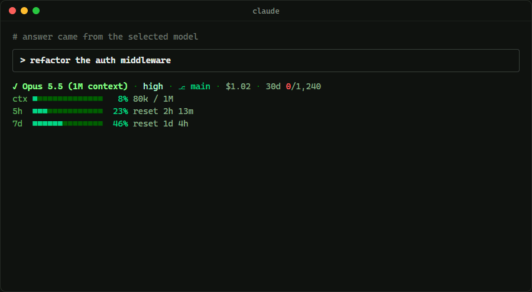

# claude-code-routing-detector

English | [한국어](README.ko.md)

<p align="center">
  
</p>

A green-themed Claude Code statusline that shows whether the model that actually answered matches the model you selected, and keeps a local history of every check.

## Install

Requires Node.js. No other dependencies.

### Plugin (recommended)

In Claude Code:

```
/plugin marketplace add seonggyujo/claude-code-routing-detector
/plugin install routing-detector@routing-detector
```

After installing, send any message. If you have no status line, the plugin sets up its own and Claude asks you to restart Claude Code once; it shows after that restart (Claude Code reads the status line setting only when it starts). If you already have a status line of your own, it is left as is; run `/routing-detector:setup` to add a model-check line to it or to replace it.

| Command | What it does |
|---|---|
| `/routing-detector:setup` | Choose from a numbered list: only if you have no status line, add a line to yours, replace yours, or turn it off |
| `/routing-detector:history [days]` | Show the [history](#history) report (default: 30 days) |
| `/routing-detector:disable` | Turn it off and bring back your previous status line |

Uninstalling does not undo the setup, so run `/routing-detector:disable` before `/plugin uninstall`.

How the plugin sets things up: it copies the scripts to `~/.claude/routing-detector/` and points `statusLine` in `~/.claude/settings.json` at that copy. The plugin's own folder changes with every version, so a session start hook refreshes the copy after an update. Your previous `statusLine` is saved and restored by `disable`.

### Manual

1. Save `statusline.js` to `~/.claude/statusline.js`, and `report.js` next to it for the history summary:

   ```sh
   curl -o ~/.claude/statusline.js https://raw.githubusercontent.com/seonggyujo/claude-code-routing-detector/main/statusline.js
   curl -o ~/.claude/report.js https://raw.githubusercontent.com/seonggyujo/claude-code-routing-detector/main/report.js
   ```

2. Add this to `~/.claude/settings.json`:

   ```json
   {
     "statusLine": {
       "type": "command",
       "command": "node ~/.claude/statusline.js",
       "refreshInterval": 20
     }
   }
   ```

   `refreshInterval` keeps the reset timers moving while the session is idle.

   On Windows, use forward slashes in the `command` path.

## What it shows

| Line | Content |
|---|---|
| 1 | Model check · thinking effort · git branch · session cost (API-equivalent) · 30-day summary |
| 2 | Context window usage |
| 3 | 5-hour usage limit, time until reset |
| 4 | Weekly usage limit, time until reset |

The model check has three states:

| Display | Meaning |
|---|---|
| `✓ Opus 5.5` (green) | The latest answer came from the selected model |
| `⚠ selected:<id> / actual:<id>` (red) | The latest answer came from a different model |
| `… Opus 5.5` (muted) | Waiting for the next answer: no answer yet, you just switched models with `/model`, or the latest answer was written before the status line started watching |

The 30-day summary `30d 0/1,240` shows mismatches out of answers checked in the last 30 days.

Lines 3 and 4 appear only for Claude Pro/Max subscribers, after the first answer in a session.

With the plugin's "add a line to mine" setup, your own status line stays and only line 1 (model check and 30-day summary) is added below it.

## Colors

Everything is drawn in shades of green, so the status line stays calm when nothing is wrong. Red marks what needs your attention.

| Color | Used for |
|---|---|
| Bright green | Selected model confirmed (`✓`) |
| Green | Git branch, meter bars under 70% |
| Yellow-green | Meter bars from 70% to 89% |
| Red | Model mismatch (`⚠`), mismatch count in the 30-day summary, meter bars at 90% or more |
| Muted greens | Effort, labels, cost, token counts, reset times, separators |

## How it works

1. Claude Code passes the selected model (`model.id`) and the transcript path (`transcript_path`) to the status line on stdin.
2. The script reads only the part of the transcript added since its last run and finds the new answers of the main conversation.
3. It compares each new answer's `message.model` with the model selected at that moment and appends the result to the [history](#history).

Each answer is checked once, when the status line first sees it. So switching models with `/model` does not turn an earlier answer into a mismatch.

Details:

- Subagent entries (`isSidechain: true`) are skipped, because subagents can use other models on purpose.
- `<synthetic>` entries (placeholders written on interruptions and errors) are skipped.
- One answer is often written as several transcript lines (thinking, text, tool calls) that share a `message.id`. It counts once.
- Suffixes such as `[1m]` and date suffixes such as `-20251001` are ignored when comparing.
- When the status line first sees a transcript (a resumed session, or right after install), it does not check the answers already in it, because it cannot know which model was selected when they were written.

## History

Every checked answer is appended to `~/.claude/routing-detector/history.jsonl`: time, session ID, project path, selected model, reported model and message ID. The file stays on your machine.

To see the report, run `/routing-detector:history` with the plugin, or with a manual install:

```sh
node ~/.claude/report.js      # last 30 days
node ~/.claude/report.js 7    # last 7 days
```

Example output:

```
Last 30 days: 334 answers checked, 3 reported a model other than the one selected (0.9%).

09-20  ■■■■■■■■■■■■■■■■■    82
09-21  ■■■■■■■■■■■          54
09-22  ■■■■■■■■■■■■■■       71  ⚠ 2
09-23  ■■■■■■               29
09-24  ■■■■■■■■■■■■■■■■■■■■ 98  ⚠ 1

Answers by reported model:
  claude-opus-5-5  331
  claude-sonnet-5    3

Mismatches:
  2026-09-22 09:00  selected claude-opus-5-5  reported claude-sonnet-5  /home/me/project
  2026-09-22 09:07  selected claude-opus-5-5  reported claude-sonnet-5  /home/me/project
  2026-09-24 09:00  selected claude-opus-5-5  reported claude-sonnet-5  /home/me/project
```

A mismatch in the history means only that the reported model name differed from your selection at that moment. It can also come from settings that make Claude Code use another model on purpose, such as a fallback model, or from switching models while an answer is still in progress.

## Limitations

- `message.model` is the model name that the API server writes into its response. This tool checks that the **reported** model matches your selection. If a server reported a model name that did not match the model that actually ran, this tool could not detect it. No client-side tool can verify that.
- Only answers written while this status line runs are checked. Answers from sessions without it, and answers already in a transcript when the status line first sees it, are not in the history.

## Test

```sh
node test.js
```

Feeds fake transcripts to the script and checks the display and the history: match, mismatch, `/model` switch, answers split over several lines, several answers in one turn, a line still being written, new and resumed sessions, large and missing files. It also checks the report, the 30-day summary, and the plugin setup: turning on at session start, each `/routing-detector:setup` choice, restoring your status line, and merge mode with a failing or slow status line of your own.

## License

MIT
